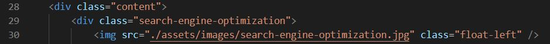
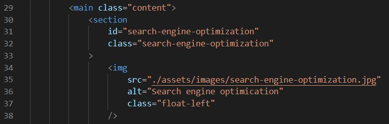
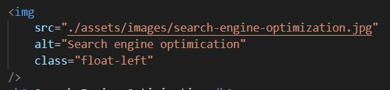
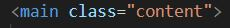
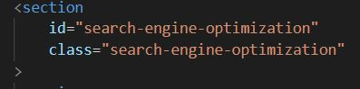
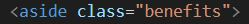

## Horiseon-Refactor

## Description 
I was given a HTML/CSS page and was tasked to refactor the existing code to meet a certain set of standards. I learn how to read a HTML and CSS page and use the right elements for HTML semantic structure. I learned how to target elements with ID and class.

## Changes

**1** I made sure that that the nav links to the correct spots on the on the page.

Before 

After

**2** I added alt attributes to all the img tags.

**3** I changed div tags to semantic tags. 

**4** I added comments to the css page to make it easier to find and read

**5** Rearanged the css and grouped them together to make it easier to find and change

